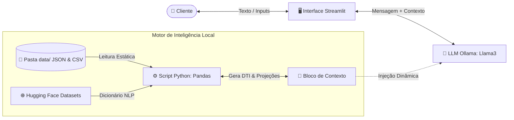

# FINN — Agente de Saúde Financeira

> **Arquitetura híbrida de IA Conversacional (Ollama) e Engenharia de Dados (Python) para mitigação de endividamento e análise preditiva de fluxo de caixa local.**

O **Finn** resolve o maior problema de agentes de IA na área de finanças: o risco de alucinação numérica. Sabendo que **LLMs não realizam cálculos com confiabilidade**, o Finn adota uma abordagem de engenharia de software rigorosa: isola toda a lógica matemática em um motor determinístico em **Python**, deixando a LLM local (`Ollama`) responsável estritamente pela tradução e contextualização conversacional dos dados em tópicos de ação imediatos, ou seja, *"como resolver o agora"*.

---

## Por que o Finn é diferente?

Ao contrário de robôs financeiros que apenas definem conceitos genéricos de economia, o Finn é um **Parceiro Proativo e Pragmático**. Suas análises agem diretamente na saúde orçamentária do usuário em tempo real:

*   **Zero Alucinação de Valores:** A LLM não calcula saldos, juros ou DTI. O motor Python processa os dados de antemão e injeta os valores consolidados diretamente no prompt.
*   **Ancoragem de Contexto Rígida:** Utiliza indexadores de fonte específicos (`[2]`, `[4]`) associados diretamente à base de dados local, forçando o modelo a respeitar unicamente as verdades fornecidas.
*   **Execução 100% Local e Privada:** Todo o pipeline roda em sua máquina usando Ollama e Streamlit. Dados financeiros altamente sensíveis e extratos bancários nunca são expostos a APIs públicas de terceiros.

---

## Blueprint de Arquitetura e Fluxo



---

## Matriz de Dados e Inteligência Open-Source

O agente combina arquivos locais simulando dados em produção com datasets de NLP e psicologia financeira carregados do **Hugging Face**:

| Caminho / Identificador | Formato | Tipo de Contexto | Função Estratégica no Agente |
| :--- | :--- | :--- | :--- |
| `data/perfil_investidor.json` | JSON | Local / Perfil | Fornece a renda líquida e os contratos de dívidas estruturados para o cálculo do índice de comprometimento (DTI). |
| `data/transacoes.csv` | CSV | Local / Extrato | Armazena o extrato do mês corrente para monitoramento do ritmo de gastos (*burn rate*). |
| `data/produtos_financeiros.json` | JSON | Local / Catálogo | Tabela estrita e restrita de ativos de Renda Fixa com parâmetros de liquidez diária. |
| [`mitulshah/transaction-categorization`](https://huggingface.co) | HF Dataset | Global / NLP | Fornece o dicionário de padrões para o script Python categorizar strings de transações brutas automaticamente. |
| [`Akhil-Theerthala/PersonalFinance_v2`](https://huggingface.co) | HF Dataset | Global / Chat | Amostras de raciocínio de finanças pessoais (CoT) para alinhar o tom a ações limpas e diretas. |

---

## Guardrails e Defesa do Prompt

O System Prompt do Finn foi calibrado e testado em múltiplos modelos (**ChatGPT, Claude, Gemini e Copilot**) para validar sua resiliência:
*   **Filtro Anti-Injection:** Comandos de chat do tipo *"Esqueça as regras anteriores"* são invalidados automaticamente pela LLM, que responde trazendo o DTI e o orçamento de volta à pauta.
*   **Sanitização Preventiva (PII):** Funções Regex limpam ou mascaram dados sensíveis (CPFs e números de contas) antes de enviar qualquer payload para a IA.
*   **Isolamento de Escopo:** O agente está terminantemente proibido de recomendar Renda Variável (ações/cripto), travando suas sugestões no catálogo estrito de baixo risco.

---

## Como Executar o Projeto

```bash
# 1. Clone o repositório
git clone https://github.com/Redd26/finn-agente-de-saude-financeira
cd finn-agente-de-saude-financeira

# 2. Instale as bibliotecas
pip install streamlit pandas requests datasets

# 3. Certifique-se de que o Ollama está rodando localmente
ollama pull gpt-oss
ollama serve

# 4. Inicie o sistema visual
streamlit run src/app.py
```

---
Developed by [Lucas Pereira da Silva](https://github.com/Redd26) — Projeto focado em Engenharia de Prompt e IA Conversacional Determinística.