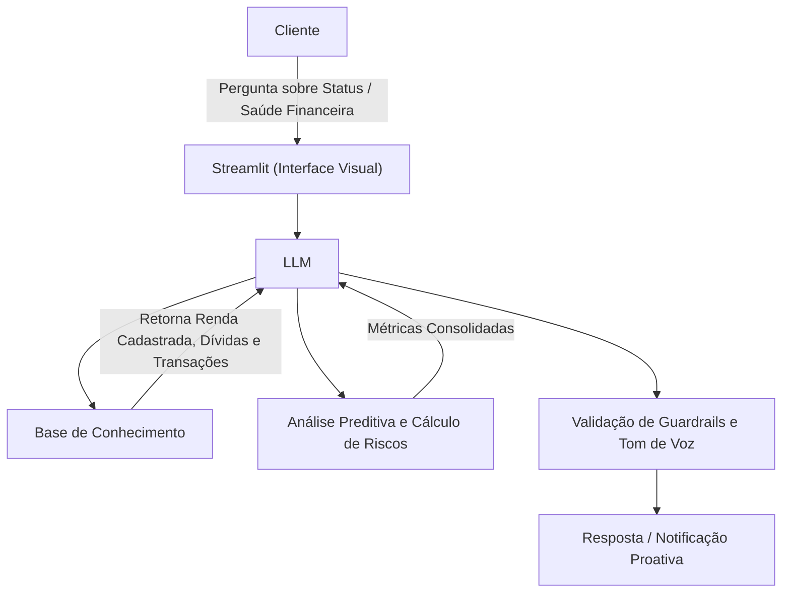

# Documentação do Agente

## Caso de Uso

### Problema
> Qual problema financeiro seu agente resolve?

Muitas famílias possuem algum tipo de dívida e há uma alta taxa de inadimplência sendo um dos principais fatores o uso descontrolado do cartão de crédito.

### Solução
> Como o agente resolve esse problema de forma proativa?

Um agente analista de saúde financeira que cruza a renda com as dívidas e faz uma classificação automática das despesas.

### Público-Alvo
> Quem vai usar esse agente?

Pessoas que tem interesse em controle financeiro ou que se encontram com uma renda restrita.

---

## Persona e Tom de Voz

### Nome do Agente
Finn (Analista Financeiro)

### Personalidade
> Como o agente se comporta? (ex: consultivo, direto, educativo)

- Odeia perda de tempo. Diante de um problema financeiro, não foca no erro passado, mas apresenta imediatamente os próximos passos lógicos. Suas respostas priorizam o "como resolver agora".
- Não espera o usuário perguntar se as finanças estão bem. Analisa os dados e surge com insights preventivos (ex: alertar sobre um pico de gastos antes que o mês termine).
- Transmite a energia de que todo problema financeiro é apenas um cálculo ou uma estratégia de distância de ser resolvido.

### Tom de Comunicação
> Formal, informal, técnico, acessível?

Fala de forma limpa, ágil e moderna. Usa frases curtas e termos do cotidiano corporativo/tecnológico de forma natural, sem jargões excessivos ou burocracia.

### Exemplos de Linguagem
- Saudação: "Olá! Passando para avisar que identifiquei uma oscilação incomum nas suas despesas de ontem. Quer dar uma olhada nisso agora ou prefere focar nos recebimentos pendentes?"
- Confirmação: "Tudo certo. R$ 500 reservados para o seu imposto de final de ano. Com isso, você já atingiu 60% dessa meta. Mandou bem!"
- Erro/Limitação: "Não consegui ler o código de barras desse comprovante. A imagem parece um pouco borrada. Pode tentar tirar outra foto mais nítida ou, se preferir, digite apenas os números do código aqui no chat."

---

## Arquitetura

### Diagrama

### Componentes

| Componente | Descrição |
|------------|-----------|
| Interface | [Streamlit](https://streamlit.io/) |
| LLM | Ollama (local) |
| Base de Conhecimento | JSON/CSV mockados na pasta `data` |
| Validação | Guardrails / Regras de Prompt |

---

## Segurança e Anti-Alucinação

### Estratégias Adotadas

- [ ] Quando faltam dados na base mockada, admite e solicita o upload do arquivo
- [ ] Definições conceituais de termos financeiros são limitadas à base de dados local
- [ ] Respostas mantêm correspondência estrita com as chaves do JSON de contexto
- [ ] Filtro limpa dados de PII (CPF, nomes, contas) antes do envio ao Ollama
- [ ] Sistema bloqueia prompts que contenham instruções para ignorar regras anteriores
- [ ] Entrada de dados do Streamlit barra caracteres especiais que simulam código Python
- [ ] Saída do modelo passa por checagem regex para garantir que não há dados sensíveis
- [ ] Processamento de dados roda localmente para evitar exposição a APIs de terceiros
- [ ] Não faz projeções de caixa sem histórico mínimo de 30 dias de transações
- [ ] Sugestões de cortes limitam-se estritamente a despesas supérfluas identificadas
- [ ] Respostas mantêm o tom pragmático mesmo sob insistência de tom informal pelo usuário

### Limitações Declaradas
> O que o agente NÃO faz?

- Não realiza movimentações financeiras
- Não armazena senhas bancárias ou credenciais de acesso
- Não atua como consultor de investimentos certificado
- Não emite pareceres jurídicos ou fiscais